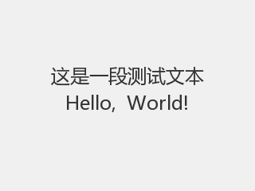

## 渲染一个字

以下程序的功能是渲染一个红色的“字”并将它保存至 PNG 文件中，使用的字体为宋体。

``` c
#include <LCUI_Build.h>
#include <LCUI/LCUI.h>
#include <LCUI/graph.h>
#include <LCUI/font.h>

int main( void )
{
        int ret, fid;
        LCUI_Graph img;
        LCUI_FontBitmap bmp;
        LCUI_Pos pos = {25, 25};

        /* 初始化字体处理功能 */
        LCUI_InitFont();

        /* 创建一个图像，并使用灰色填充 */
        Graph_Init( &img );
        Graph_Create( &img, 100, 100 );
        Graph_FillRect( &img, RGB( 240, 240, 240 ), NULL, FALSE );

        /* 载入字体文件 */
        ret = LCUIFont_LoadFile( "C:/Windows/fonts/simsun.ttc" );
        while( ret == 0 ) {
                /* 获取字体ID */
                fid = LCUIFont_GetId( "SimSun", NULL );
                if( fid < 0 ) {
                        break;
                }
                /* 载入对应的文字位图，大小为 48 像素 */
                ret = FontBitmap_Load( &bmp, L'字', fid, 48 );
                if( ret != 0 ) {
                        break;
                }
                /* 绘制红色文字到图像上 */
                FontBitmap_Mix( &img, pos, &bmp, RGB( 255, 0, 0 ) );
                Graph_WritePNG( "test_char_render.png", &img );
                /* 释放内存资源 */
                FontBitmap_Free( &bmp );
                Graph_Free( &img );
                break;
        }

        /* 退出字体处理功能 */
        LCUI_ExitFont();
        return ret;
}
```

编译运行后，可以在程序所在工作目录下找到 test_char_render.png 文件，打开它可看到如下图所示的内容：


在绘制文字时都需要指定字体的 ID，这个 ID 标识了字体的字族和风格，如果要使用默认的字体，可以使用 -1 作为 ID。字体位图数据是 LCUI_FontBitmap 类型，可以用 FontBitmap_Mix() 函数将该字体位图绘制到指定的图像上，该函数支持自定义字体颜色。

## 渲染一段文字

绘制一个文字比较容易，但用绘制一个文字的方法去绘制一段文字的话，实现起来会很复杂，针对这个问题，可以用 LCUI 提供的文本图层（TextLayer）来解决，除了基本的文本绘制功能外，还具备一下功能：

- 自定义全局文字的对齐方式
- 用标签设定其中一段文字的颜色和大小
- 文本的插入、删除功能，以及光标定位

LCUI 的文本显示（TextView）部件和文本编辑框（TextEdit）部件就是基于该模块实现的。

以下是简单的示例程序：

``` c
#include <LCUI_Build.h>
#include <LCUI/LCUI.h>
#include <LCUI/graph.h>
#include <LCUI/font.h>

int main( void )
{
        int ret;
        LCUI_Graph img;
        LCUI_Pos pos = {0, 80};
        LCUI_Rect area = {0, 0, 320, 240};
        LCUI_TextLayer txt = TextLayer_New();
        LCUI_TextStyle txtstyle;

        /* 初始化字体处理功能 */
        LCUI_InitFont();

        /* 创建一个图像，并使用灰色填充 */
        Graph_Init( &img );
        Graph_Create( &img, 320, 240 );
        Graph_FillRect( &img, RGB( 240, 240, 240 ), NULL, FALSE );

        /* 设置文本的字体大小 */
        TextStyle_Init( &txtstyle );
        txtstyle.pixel_size = 24;
        txtstyle.has_pixel_size = TRUE;

        /* 设置文本图层的固定尺寸、文本样式、文本内容、对齐方式 */
        TextLayer_SetFixedSize( txt, 320, 240 );
        TextLayer_SetTextStyle( txt, &txtstyle );
        TextLayer_SetTextAlign( txt, SV_CENTER );
        TextLayer_SetTextW( txt, L"这是一段测试文本\nHello, World!", NULL );
        TextLayer_Update( txt, NULL );

        /* 将文本图层绘制到图像中，然后将图像写入至 png 文件中 */
        TextLayer_DrawToGraph( txt, area, pos, &img );
        ret = Graph_WritePNG( "test_string_render.png", &img );
        Graph_Free( &img );

        /* 退出字体处理功能 */
        LCUI_ExitFont();
        return ret;
}
```


编译运行后，可以在程序所在工作目录下找到 test_string_render.png 文件，打开它可看到如下图所示的内容：



在为 TextLayer 设置文本、修改文字样式后，需要调用 TextLayer_Update() 函数以应用这些更改，该函数的第二个参数是个链表，用于保存文本图层中需要刷新的区域，如果不需要这些数据可以将该参数设置为 NULL。

TextLayer 提供了 TextLayer_DrawToGraph() 函数用于将文本图层绘制到图像中，第二个参数指定 TextLayer 中需要绘制的区域，第三个参数指定绘制出的内容在图像中的位置。