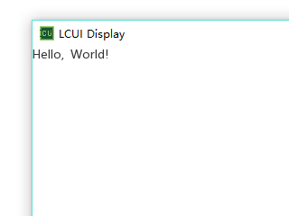

## 一个最小的应用

``` c
#include <LCUI_Build.h>
#include <LCUI/LCUI.h>
#include <LCUI/gui/widget.h>
#include <LCUI/gui/widget/textview.h>

int main( int argc, char **argv )
{
        LCUI_Widget root, txt;

        LCUI_Init();
        root = LCUIWidget_GetRoot();
        txt = LCUIWidget_New( "textview" );
        TextView_SetText( txt, "Hello, World!" );
        Widget_Append( root, txt );
        return LCUI_Main();
}
```

把它保存为 helloworld.c 或其它类似名称，然后用你的编译器编译它，编译成功后运行输出的可执行文件，你会看到如下的效果：



那么，这些代码是什么意思呢？

- 开头两行引入了 LCUI_Build.h 和 LCUI/LCUI.h，这两个头文件中主要包含了 LCUI 应用程序必要的相关参数、数据结构定义以及常用函数声明。
- 接着又引入了 LCUI/gui/widget.h 和 LCUI/gui/widget/textview.h，这两个头文件是属于图形界面相关的，widget.h 包含了部件相关的通用操作函数，而 textview.h 包含了预置的文本显示（textview）部件的相关操作函数。
- 在 `main()` 函数中，定义了两个类型为 `LCUI_Widget` 的变量，用于保存后面将要用到的部件。
- 在使用 LCUI 相关功能之前，需要先调用 `LCUI_Init()` 函数对 LCUI 进行初始化，因为 LCUI 大部分功能都必须在初始化后才能使用。
- 调用 `LCUIWidget_GetRoot()` 函数获取根级部件，在 LCUI 中，只有根级部件内的部件才能显示在屏幕上。
- 调用 `LCUIWidget_New()` 函数创建一个类型为 textview 的部件，并用 txt 变量保存。
- 调用 `TextView_SetText()` 函数指定 textview 部件所显示的文本，注意，该函数的第二个参数（字符串）的编码方式必须是 UTF-8，否则非英文字符可能会显示成乱码。
- 在部件创建完后，需要调用 `Widget_Append()` 函数将它追加到根级部件上，以让 LCUI 能够处理并将它显示在屏幕上。
- 最后，调用 `LCUI_Main()` 函数进入 LCUI 的主循环，执行后续产生的各种任务，顺便让程序保持运行。
