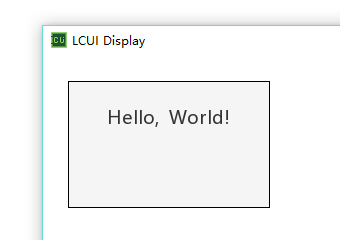

## 改进视觉效果

以上程序主要实现了简单的文本显示，接下来将介绍如何调整文字的位置、大小、颜色。

``` c
#include <LCUI_Build.h>
#include <LCUI/LCUI.h>
#include <LCUI/gui/widget.h>
#include <LCUI/gui/widget/textview.h>

int main( int argc, char **argv )
{
        LCUI_Widget root, txt;
        LCUI_StyleSheet style;

        LCUI_Init();
        root = LCUIWidget_GetRoot();
        txt = LCUIWidget_New( "textview" );
        style = txt->custom_style;
        SetStyle( style, key_margin_top, 25, px );
        SetStyle( style, key_margin_left, 25, px );
        SetStyle( style, key_padding_top, 25, px );
        SetStyle( style, key_border_width, 1, px );
        SetStyle( style, key_border_color, RGB( 0, 0, 0 ), color );
        SetStyle( style, key_background_color, RGB( 245, 245, 245 ), color );
        TextView_SetText( txt, "[size=18px]Hello, World![/size]" );
        TextView_SetTextAlign( txt, SV_CENTER );
        Widget_Resize( txt, 200, 100 );
        Widget_Append( root, txt );
        return LCUI_Main();
}
```

在原有的代码上补充了几行代码，运行效果如下：



继续讲解代码：
- 为节省后面代码的宽度，定义了一个类型为 LCUI_StyleSheet 的 style 变量来引用 txt->custom_style 。每个部件都有三张样式表：style（当前应用的样式）、inherited_style（继承的样式）、custom_style（自定义样式），style 表是由 inherited_style 和 custom_style 这两张样式表合并而成的，通常为部件添加额外的样式只需要修改 custom_style 表，而其它两张表是由 LCUI 负责生成的，即使手动修改它的内容也会很快还原。
- 调用 SetStyle() 为部件设置外间距、内间距、边框和背景色，上外间距和左外间距都为 25 像素，上内间距为 25 像素，边框线的宽度为 1 像素，颜色为纯黑，背景色为灰色。
- SetStyle() 是一个宏，主要用于简化部件样式表的修改操作，感兴趣的话可以查看它的定义。
- `key_` 的开头标识符都是枚举，用于表示各个样式属性在样式表中的位置，为方便识别，并没有和普通枚举那样采用全大写字母的命名方式。
- `[size=18px]` 表示的是将字体的大小设置为 18 像素。TextView 部件默认支持样式标签，但当前支持的样式标签只有 `[size]` 和 `[color]`，你可以直接在文本内使用它们来设置简单的样式。
- TextView_SetTextAlign() 函数为 TextView 部件设置文本对齐方式，支持的对齐方式有三种：靠左（SV_LEFT）、居中（SV_CENTER）、靠右（SV_RIGHT），SV 是样式值（Style Value）的缩写。
- 调用 Widget_Resize() 调整部件的尺寸为 200 x 100。

看了上面的代码你可能会想：为什么修改部件的坐标需要设置外间距？不是直接设置 xy 坐标就可以了吗？

LCUI 有提供 Widget_Move() 函数，用于修改部件的坐标，但对于默认定位方式的部件来说，这个函数并没有任何效果。LCUI 的布局方式和浏览器中的网页布局类似，部件在默认的定位方式下，能够影响坐标的只有外间距，除非更改该部件的定位方式，具体内容在后面的章节中会介绍。
