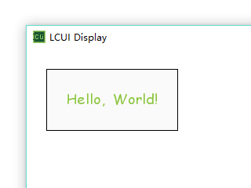

## 简化界面描述代码

上一章节介绍了如何用 C 代码描述界面效果，只是实现简单的效果的话，这代码看上去还行，但如果需要描述复杂点的界面的话，写出来的 C 代码会变得臃肿且难以阅读和维护，为解决这个问题，可以改用 XML 和 CSS。以下是 CSS 代码，请将其保存为 helloworld.css 文件。

``` css
textview.text-hello {
  color: #8cc63f;
  font-size: 18px;
  font-family: "Comic Sans MS";
  text-align: center;
  padding: 25px;
  margin: 25px 0 0 25px;
  border: 1px solid #000;
  background-color: #aaa;
}
```

这里的 CSS 代码对于有写过网页的人来说应该很容易理解，如果你对 CSS 代码的语法规则并不了解，可以参考网上的相关教程。LCUI 虽然支持 CSS 代码，但与网页浏览器不同，只支持处理简单的 CSS 样式，并且某些 CSS 样式的实际效果会根据 LCUI 的现有情况做一定的调整，属于定制版的 CSS。

`textview.text-hello` 是选择器，其中 textview 指的是部件类型，而 `.text-hello` 指的是样式类，也就是说 `{}` 花括号里的 CSS 样式只对拥有 text-hello 类的 textview 部件有效。

color、font-size、font-family、text-align 这四个属性是 textview 部件扩展的属性，仅对 textview 类型的部件有效，分别用于设置文字的颜色、字体大小、字族名称、对齐方式。

新建 helloworld.xml 文件，保存以下代码：

``` xml
<?xml version="1.0" encoding="UTF-8" ?>
<lcui-app>
  <resource type="text/css" src="helloworld.css"/>
  <resource type="application/font-ttf" src="C:/Windows/Fonts/comic.ttf"/>
  <ui>
    <widget type="textview" class="text-hello">Hello, World!</widget>
  </ui>
</lcui-app>
```

以下是这段 XML 代码的说明：
- 第一行指定了 XML 的版本及文档编码方式。
- &lt;lcui-app&gt; 标签用于表示里面的代码是针对 LCUI 应用程序的。
- &lt;resource&gt; 标签用于指示 LCUI 需要加载的资源，type 属性表示资源的类型，src 属性表示资源文件的位置。
- 加载 helloworld.css 资源文件，将其内容作为 CSS 文本来处理。
- 加载 C:/Windows/Fonts/comic.ttf 资源文件，将其作为 ttf 字体文件来处理。
- &lt;ui&gt; 标签用于容纳所有与界面相关的内容，一个 XML 文档中只能有一个 &lt;ui&gt; 标签，相当于 HTML 文档中的 &lt;body&gt; 标签。
- &lt;widget&gt; 标签指示 LCUI 创建一个部件，type 属性表示部件类型，class 属性表示该部件拥有的样式类。&lt;widget&gt; 标签内可以嵌套文本，但文本是否有用取决于该类型的部件是否支持。
- 创建一个 textivew 类型的部件，拥有 text-hello 样式类，并设置其文本内容为 Hello, World!。

接下来是主程序的实现代码：

``` c
#include <LCUI_Build.h>
#include <LCUI/LCUI.h>
#include <LCUI/gui/widget.h>
#include <LCUI/gui/builder.h>

int main( int argc, char **argv )
{
        LCUI_Widget root, pack;

        LCUI_Init();
        root = LCUIWidget_GetRoot();
        pack = LCUIBuilder_LoadFile( "helloworld.xml" );
        if( !pack ) {
                return -1;
        }
        Widget_Append( root, pack ); 
        Widget_Unwrap( pack );
        return LCUI_Main();
}
```

当有了 XML 和 CSS 文件后，需要让程序载入它们，XML 文件的载入与解析功能由 `LCUIBuilder_LoadFile()` 函数提供，该函数在 LCUI/gui/builder.h 头文件有声明。如果 XML 文件载入失败，`LCUIBuilder_LoadFile()` 函数会返回 NULL，如果载入成功则会返回一个部件，这个部件主要用于容纳 &lt;ui&gt; 标签中出现的各个部件，相当于一个容器，对于这个容器，可以先将它追加到根级部件中，然后调用 `Widget_Unwrap()` 函数展开该部件的内容，在展开后该部件会被销毁。

以下是程序的运行效果：


