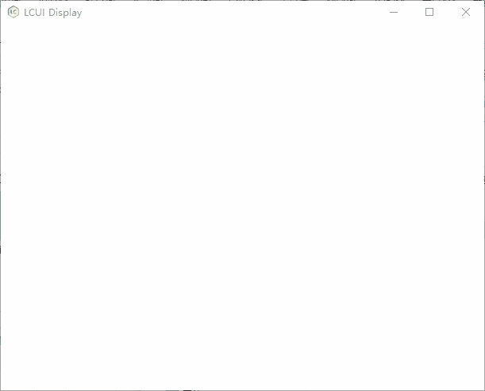

## 触控事件

LCUI 支持触控事件，但目前仅在 Windows 系统中有效，以下是触控事件的数据结构定义：

``` c
typedef struct LCUI_TouchPointRec_ {
        int x;
        int y;
        int id;
        int state;
        LCUI_BOOL is_primary;
} LCUI_TouchPointRec, *LCUI_TouchPoint;

typedef struct LCUI_TouchEvent_ {
        int n_points;
        LCUI_TouchPoint points;
} LCUI_TouchEvent;

typedef LCUI_TouchEvent LCUI_WidgetTouchEvent;
```

触控事件的数据结构设计参考自 Windows API，只保留了主要的成员变量。LCUI 内部的触控事件和部件级的触控事件是一样的数据结构。

从上述代码中可以比较容易的理解到：触控事件包含多个触点的信息，n_points 表示当前共有多少个触点，每个触点都有自己的 x、y 坐标，并且有个 id 用于标识该触点，而 state 表示该触点的状态，它的值有三种：WET_TOUCHDOWN、WET_TOUCHUP、WET_TOUCHMOVE，这些值分别对应：触点按下、触点释放、触点移动这三个状态。

以下是测试触控事件的程序：

``` c
/** testtouch.c -- test touch support */

#include <stdio.h>
#include <LCUI_Build.h>
#include <LCUI/LCUI.h>
#include <LCUI/graph.h>
#include <LCUI/display.h>
#include <LCUI/gui/widget.h>

/** 触点绑定记录 */
typedef struct TouchPointBindingRec_ {
        int point_id;                   /**< 触点 ID */
        LCUI_Widget widget;             /**< 部件 */
        LinkedListNode node;            /**< 在链表中的结点 */
        LCUI_BOOL is_valid;             /**< 是否有效 */
} TouchPointBindingRec, *TouchPointBinding;

/** 触点绑定记录列表 */
static LinkedList touch_bindings;

static void OnTouchWidget( LCUI_Widget w, LCUI_WidgetEvent e, void *arg )
{
        LCUI_TouchPoint point;
        TouchPointBinding binding;
        if( e->touch.n_points == 0 ) {
                return;
        }
        binding = e->data;
        point = &e->touch.points[0];
        switch( point->state ) {
        case WET_TOUCHMOVE:
                Widget_Move( binding->widget, point->x - 32, point->y - 32 );
                break;
        case WET_TOUCHUP:
                if( !binding->is_valid ) {
                        break;
                }
                /* 当触点释放后销毁部件及绑定记录 */
                Widget_ReleaseTouchCapture( binding->widget, -1 );
                LinkedList_Unlink( &touch_bindings, &binding->node );
                binding->is_valid = FALSE;
                Widget_Destroy( w );
                free( binding );
                break;
        case WET_TOUCHDOWN:
        default: break;
        }
}

static void OnTouch( LCUI_SysEvent e, void *arg )
{
        int i;
        LinkedListNode *node;
        LCUI_StyleSheet sheet;
        LCUI_TouchPoint point;
        for( i = 0; i < e->touch.n_points; ++i ) {
                TouchPointBinding binding;
                LCUI_BOOL is_existed = FALSE;
                point = &e->touch.points[i];
                /* 检查该触点是否已经被绑定 */
                LinkedList_ForEach( node, &touch_bindings ) {
                        binding = node->data;
                        if( binding->point_id == point->id ) {
                                is_existed = TRUE;
                        }
                }
                if( is_existed ) {
                        continue;
                }
                /* 新建绑定记录 */
                binding = NEW( TouchPointBindingRec, 1 );
                binding->widget = LCUIWidget_New( NULL );
                binding->point_id = point->id;
                binding->is_valid = TRUE;
                binding->node.data = binding;
                Widget_Resize( binding->widget, 64, 64 );
                Widget_Move( binding->widget, point->x - 32, point->y - 32 );
                /* 设置让该部件捕获当前触点 */
                Widget_SetTouchCapture( binding->widget, binding->point_id );
                Widget_BindEvent( binding->widget, "touch", OnTouchWidget, binding, NULL );
                sheet = binding->widget->custom_style;
                SetStyle( sheet, key_position, SV_ABSOLUTE,  style );
                SetStyle( sheet, key_background_color, RGB( 255, 0, 0 ), color );
                LinkedList_AppendNode( &touch_bindings, &binding->node );
                Widget_Top( binding->widget );
        }
}

int main( int argc, char **argv )
{
        LCUI_Init();
        LinkedList_Init( &touch_bindings );
        LCUI_BindEvent( LCUI_TOUCH, OnTouch, NULL, NULL );
        return LCUI_Main();
}
```

编译后运行，如果你的计算机自带触屏，可以用手指在程序窗口内点击、移动，会看到类似于如下图所示的效果：



这个程序实现的功能是捕获各个触点并用对应的红色方块表示触点的位置，有个 `touch_bindings` 全局变量用于保存各个触点和部件的绑定记录，在响应触控事件时会遍历每个触点，根据触点的 id 在绑定记录中找对应的部件，找到后会根据触点的坐标来更新部件的坐标。为了让部件能够捕获触点在它外面产生的触控事件，并且不被其它部件捕获到，调用了 `Widget_SetTouchCapture()` 函数实现对该触点的独占，在触点释放后，调用 `Widget_ReleaseTouchCapture()` 函数解除对触点的独占。
