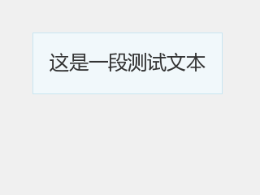

## 渲染

本章节将介绍 `Widget_Render()` 函数的基本用法，`Widget_Render()` 函数的主要功能是渲染部件内容，LCUI 输出的图形界面都是由该函数渲染出来的。

`Widget_Render()` 函数接受两个参数，第一个参数是需渲染的部件，第二个参数是 `LCUI_PaintContext` 类型的绘制实例数据，它包含 rect 和 canvas 两个成员，rect 用于指定部件中需要渲染的区域，而 canvas 是一个用于接受渲染结果的画板。

以下是示例程序：

``` c
#include <LCUI_Build.h>
#include <LCUI/LCUI.h>
#include <LCUI/graph.h>
#include <LCUI/gui/widget.h>
#include <LCUI/gui/widget/textview.h>

int main( void )
{
        int ret;
        LCUI_Graph canvas;
        LCUI_Widget root, box, txt;
        LCUI_PaintContextRec paint;
        LCUI_Rect area = {40, 40, 320, 240};
        LCUI_Color bgcolor = RGB( 242, 249, 252 );
        LCUI_Color bdcolor = RGB( 201, 230, 242 );

        LCUI_Init();

        /* 创建一些部件 */
        root = LCUIWidget_New( NULL );
        box = LCUIWidget_New( NULL );
        txt = LCUIWidget_New( "textview" );

        /* 创建一块灰色的画板 */
        Graph_Init( &canvas );
        Graph_Create( &canvas, 320, 240 );
        Graph_FillRect( &canvas, RGB( 240, 240, 240 ), NULL, FALSE );

        /* 初始化一个绘制实例，绘制区域为整个画板 */
        paint.with_alpha = FALSE;
        paint.rect.width = 320;
        paint.rect.height = 320;
        paint.rect.x = paint.rect.y = 0;
        Graph_Quote( &paint.canvas, &canvas, &area );

        /* 设定基本的样式和内容 */
        Widget_SetPadding( box, 20, 20, 20, 20 );
        Widget_SetBorder( box, 1, SV_SOLID, bdcolor );
        Widget_SetStyle( box, key_background_color, bgcolor, color );
        TextView_SetTextW( txt, L"[size=24px]这是一段测试文本[/size]" );
        Widget_Append( box, txt );
        Widget_Append( root, box );
        /* 标记需要更新样式 */
        Widget_UpdateStyle( txt, TRUE );
        Widget_UpdateStyle( box, TRUE );
        Widget_UpdateStyle( root, TRUE );
        /* 更新部件，此处的更新顺序必须是父级到子级 */
        Widget_Update( root );
        Widget_Update( box );
        Widget_Update( txt );

        /* 渲染部件 */
        Widget_Render( box, &paint );
        ret = Graph_WritePNG( "test_widget_render.png", &canvas );
        Graph_Free( &canvas );
        return ret;
}
```

编译运行后，可以在程序所在工作目录下找到 test_widget_render.png 文件，打开它可看到如下图所示的内容：



在 LCUI 中，一级部件的尺寸是与屏幕对应的，而本实例中 root 部件仅仅充当容器，因为它并没有与屏幕绑定，在调用 `Widget_Update()` 后尺寸会为 0 x 0，所以实际渲染的对象是 box。

`Widget_Update()` 需要按照从父到子的顺序调用，因为子级部件的坐标、宽度等属性的计算依赖父级部件。
